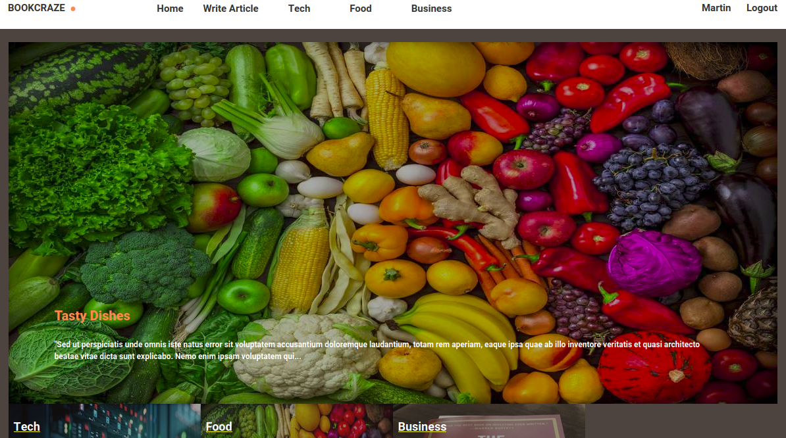

# Bookcraze App
It is a web application where bookworms can share their passion and love for the books that they love read via writing articles.

## Built With

- Ruby v2.6.5
- Ruby on Rails v6.0.3

## Live Demo

[Live Demo](https://secure-brook-97667.herokuapp.com)



## Getting Started

To get a local copy up and running, follow these simple example steps.

### Prerequisites

Ruby: 2.6.3
Rails: 5.2.3
Postgres Database
Chromium Chrome Driver: 83.0 and 

### Setup

Clone the repo

Install gems with:

```
bundle install
```

Setup database with:

```
rails db:create

```
rails db:migrate

```
rails db:seed

```

## Usage

You can clone or download this repo (you need ruby installed on your computer).

**git clone git@github.com:kwizl/lifestyle.git**
Start server with:

rails s

Open `http://localhost:3000/` in your browser.

The user can signup, login, create an article with the category that the book falls in. The user can upload a thumbnail image and article content. The created articles can be voted for by users. The most voted article appears as the main thumbnail while the rest take on smaller sizes. The category section displays the most recent articles in each category ordered by their priority.
The category names have the following priority. Wildlife - 1, Food - 2, Business- 3, Tech - 4.

**Run tests**

Make sure to have installed chromium chrome driver [link](https://chromedriver.chromium.org/downloads)

And then run:

```
bundle exec rspec
```

> All tests are contained in the RSpec folder which is in the root directory of the project. 
To run all test type **bundle exec rspec** in the terminal. To run a specific test type 
**bundle exec rspec spec/folder_name/spec_file.rb**

## Acknowledgment

This site was originally designed by **Nelson Sakwa** on Behance. It is under the **Creative Common License**

## Authors

👤 **Martin Njoroge**

- Github: [@kwizl](https://github.com/kwizl)
- Twitter: [@NjoroKaris](https://twitter.com/NjoroKaris)
- Linkedin: [martin njoroge](https://www.linkedin.com/in/martin-njoroge-098774110/)

## 🤝 Contributing

Contributions, issues, and feature requests are welcome!
